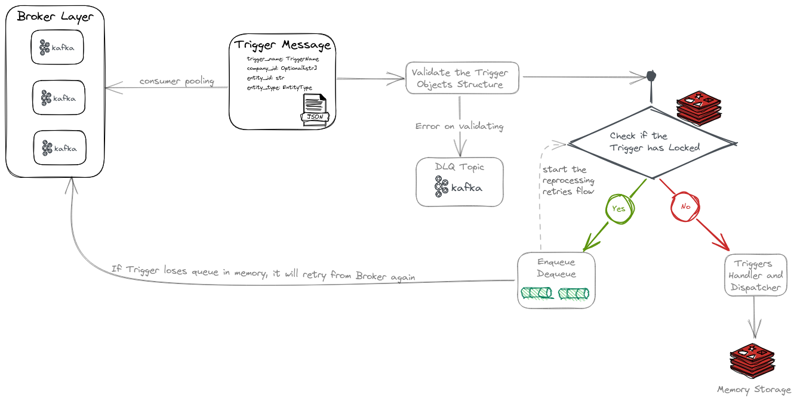

---
autor Jefferson Marchetti
For now these are the dependencies to others repositories.
---

# BrandLovrs POLARS Transformation Layer

**This module "Doorman" has the objective to monitor each trigger event received through the Broker (Kafka), to then validate its data structure, mainly the Entity_id and Entity_type fields to trigger the next step of flow "Foreman", storing it in Redis as a valid Trigger.**

---

In addition, is realized a control of events through "locking" messages in Redis and, at the same time, a second queue control [FIFO] used by the enqueue and dequeue modules is performed in memory.


 Tree Modules

According to the folder structure tree above.
The functions of our main modules will be explained in the sequence.

---



### Modules

+ Configurations
	**kafka_config**

	​	 Specialized class to provide centralized environment settings control of Kafka Broker.

	**redis_config**

	​	Specialized class to provide centralized environment settings control of Redis Database Memory.

+ Data Structures

  ​	All dependencies of data structures needs to be created here.

+ Modules
  + Consumers
    *trigger_reader.py*

    ``` python
    This module is responsible for consuming the events of the triggers in the Broker, creating a whole cache mechanism, managing and controlling lock states in [FIFO]-type queues.
    ```

  + Events

    *queue.py*

    ​    This is a FIFO-type queue control module, which helps trigger_reader

    ​    to control events for reprocessing.

    ```python
    class Queue:
        def __init__(self):
            self.queue = []

        def enqueue(self, x):
            return self.queue.insert(0, x)

        def dequeue(self):
            return self.queue.pop()

        def isEmpty(self):
            return len(self.queue) == 0

        def front(self):
            return self.queue[-1]

        def rear(self):
            return self.queue[0]
    ```

    *trigger_handler.py*

    ​	This module is responsible for effectively triggering the events received from the Broker to the next step in the Events flow.

    ​	[Call Foreman Module]


  + Repository

    + **Database**

    	memory.py*
    ```python
    This class is intended to provide support for interacting with our in-memory repository.
    Through the Memory Repository [Redis], we communicate with other steps and modules of the flow,by asynchronous events, including the lock control [FIFO].
    ```

  + Validators

    *trigger_validator.py*

    ```python
    Class responsible for validating the schemas and data structures consumed from the Broker.

        Schemas inherit from the BaseEntityTypes superclass, organized by specific topics linked to each Entity Type.
    ```


+ Utils

  This module contains generic functions with global utility in the **Events Trigger**.

+ Tests

​		Targeted unit tests using the **PyTest** library.
